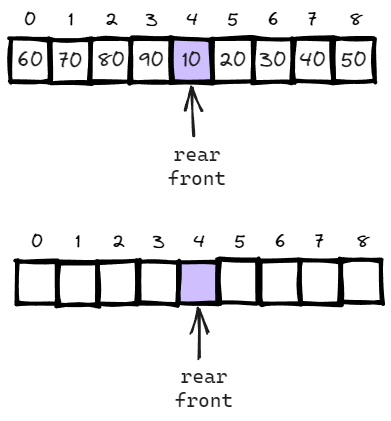
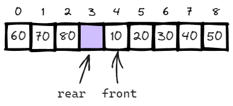

## 연습문제

### 3) 순환 큐에서 전단의 위치와 후단의 위치가 동일해졌습니다.
### 순환 큐는 지금 공백 상태입니까? 아니면 포화 상태입니까?

### 답변

- 2가지 경우가 모두 가능합니다.
- 순환 큐에서는 rear와 front가 같은 위치를 가르키고 있을 경우, 포화 상태인지 공백 상태인지 구분할 수 없는 문제가 있습니다.

- 이러한 문제를 해결하기 위해서 더미노드를 두어, 다음 값이 front일 경우, 포화상태로 간주하는 방식으로 구현합니다.