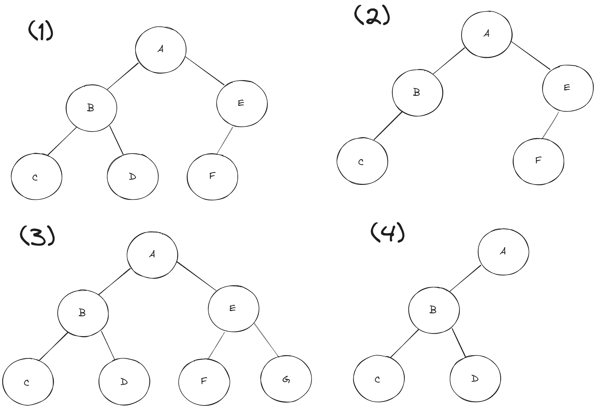
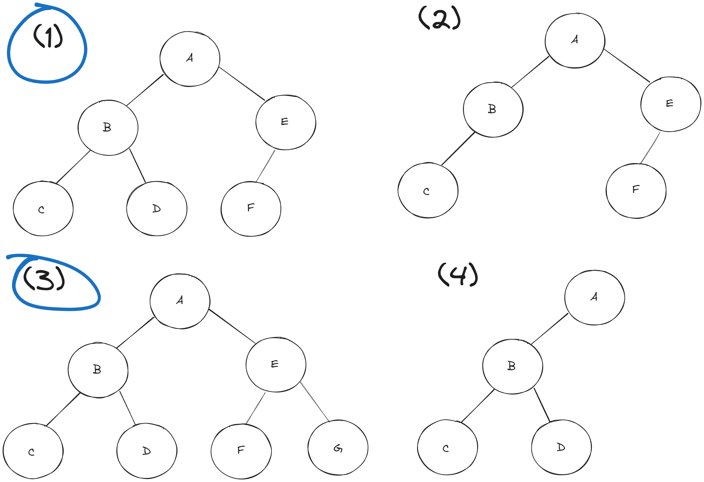

## 연습문제

### 01) 다음 세 가지 트리 중 완전 이진 트리인 것을 모두 고르세요.

<h3>답변</h3>

### 1)
- 잎 노드들이 0개의 자식 노드들을 가지고 있습니다.
- 줄기 노드는 최소 1개의 노드에서 최대 2개의 노드를 가지고 있습니다.
- 좌측에서부터 우측으로 순차적으로 채워져있습니다.
- 따라서 1번은 완전 이진트리 라고 할 수 있습니다.

### 2)
- 좌측에서부터 우측으로 순차적으로 채워져 있지 않습니다.
- 따라서 2번은 완전 이진트리 라고 할 수 없습니다.

### 3)
- 모든 줄기 노드가 2개의 자식 노드를 가지고 있는 포화 이진트리입니다.
- 포화 이진 트리는 완전 이진트리에 속합니다.
- 따라서 3번은 완전 이진트리라고 할 수 있습니다.

### 4)
- B와 같은 레벨의 줄기 노드가 존재하지 않습니다.
- 따라서 4번은 완전 이진트리라고 할 수 없습니다.